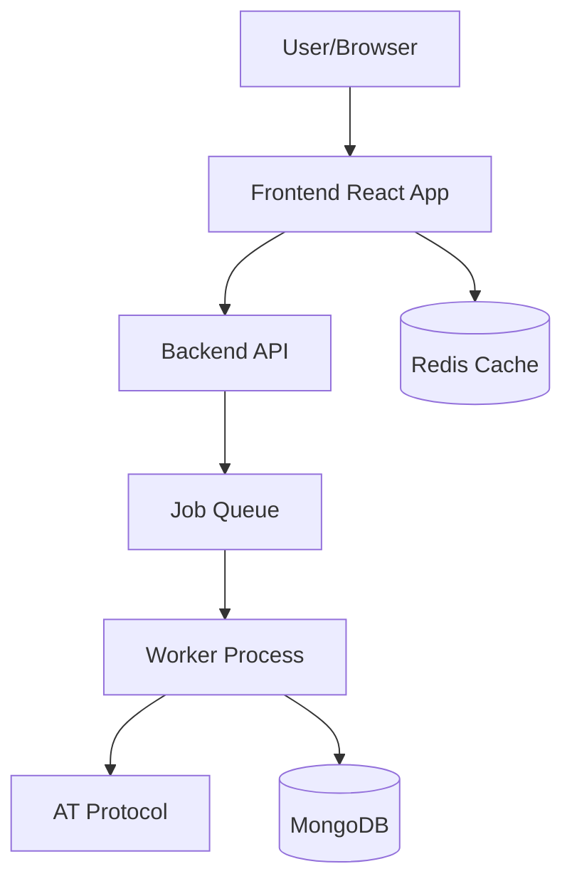

# BlueSky Network Visualizer - System Architecture

## Table of Contents
1. [Project Overview](#1-project-overview)
2. [System Architecture](#2-system-architecture)
3. [Frontend Architecture](#3-frontend-architecture)
4. [Backend Architecture](#4-backend-architecture)
5. [Data Management](#5-data-management)
6. [Technical Considerations](#6-technical-considerations)
7. [External Dependencies & Services](#7-external-dependencies--services)

## 1. Project Overview

### 1.1 Purpose & Goals
- Provide users with insights into their BlueSky social network structure
- Visualize mutual connections in an interactive 3D space
- Identify and display distinct communities within the network
- Enable exploration of connection patterns and influential nodes

### 1.2 Target Users
- BlueSky users interested in understanding their network
- Community managers and moderators
- Social network researchers
- Users curious about their social graph structure

### 1.3 Key Features
- Interactive 3D network visualization
- Community detection and highlighting
- Network metrics and statistics
- Exploration tools for large networks
- Data persistence for quick revisiting

### 1.4 Success Metrics
- Successful network analysis completion rate
- User engagement with visualization
- System performance under load
- Error rate and recovery success

## 2. System Architecture

### 2.1 High-Level Overview


### 2.2 Component Interaction
- Frontend initiates analysis via Backend API
- Backend manages job queue and worker processes
- Workers collect and process network data
- Results stored in MongoDB
- Frontend retrieves and visualizes data

### 2.3 Data Flow
1. User Authentication
   - App password verification
   - Session management
   
2. Analysis Pipeline
   - Network data collection
   - Community detection
   - Graph construction
   - Visualization preparation

### 2.4 System Components
- Frontend (Netlify)
- Backend API (Node.js)
- Job Queue (Bull + Redis)
- Database (MongoDB Atlas)
- Worker Processes

## 3. Frontend Architecture

### 3.1 User Interface
```typescript
interface UIComponents {
  layout: {
    mainView: "3D visualization space",
    controlPanel: "Network controls and filters",
    sidebar: "Details and metrics",
    statusBar: "Progress and system status"
  },
  
  interactions: {
    view: {
      zoom: "Mouse wheel / touch pinch",
      pan: "Click-drag / touch move",
      rotate: "Right-click drag / two-finger rotate"
    },
    selection: {
      node: "Click/tap",
      community: "Filter panel selection"
    }
  }
}
```

### 3.2 Technical Stack
- React 18 + TypeScript
- Three.js + React Three Fiber
- Zustand (State Management)
- React Query (API Integration)
- Tailwind CSS + shadcn/ui

### 3.3 State Management
```typescript
interface StateStructure {
  authentication: {
    status: AuthStatus,
    session: SessionData
  },
  visualization: {
    graph: GraphData,
    camera: CameraState,
    selection: SelectionState
  },
  analysis: {
    status: AnalysisStatus,
    progress: ProgressData
  }
}
```

### 3.4 Performance Optimizations
- WebGL rendering for large networks
- Dynamic level of detail
- Chunked data loading
- Client-side caching

## 4. Backend Architecture

### 4.1 Server Components
- Express.js API Server
- Bull Job Queue
- Worker Processes
- WebSocket Progress Updates

### 4.2 API Structure
```typescript
interface APIEndpoints {
  auth: {
    verify: "POST /api/auth/verify",
    status: "GET /api/auth/status"
  },
  analysis: {
    start: "POST /api/analysis/start",
    status: "GET /api/analysis/{jobId}/status",
    results: "GET /api/analysis/{jobId}/results"
  },
  network: {
    data: "GET /api/network/{jobId}",
    metrics: "GET /api/network/{jobId}/metrics"
  }
}
```

### 4.3 Job Processing
- Queue management
- Rate limiting
- Progress tracking
- Error recovery

### 4.4 Data Processing
- Network data collection
- Community detection
- Graph construction
- Metrics calculation

## 5. Data Management

### 5.1 Collection Strategy
```typescript
interface DataCollection {
  stages: [
    "Fetch user connections",
    "Identify mutual connections",
    "Analyze interconnections",
    "Detect communities"
  ],
  rateLimit: {
    maxRequests: 100,
    timeWindow: "1 minute",
    retryStrategy: "exponential"
  }
}
```

### 5.2 Storage Strategy
- MongoDB for persistent storage
- Redis for job queue and caching
- Temporary storage for processing

### 5.3 Data Models
```typescript
interface DataModels {
  network: {
    nodes: Array<Node>,
    edges: Array<Edge>,
    communities: Array<Community>
  },
  analysis: {
    metrics: NetworkMetrics,
    status: AnalysisStatus,
    metadata: AnalysisMetadata
  }
}
```

### 5.4 Caching Strategy
- User profile caching
- Network data caching
- Analysis results caching

## 6. Technical Considerations

### 6.1 Security
- Secure credential handling
- Rate limiting
- Input validation
- Error handling

### 6.2 Error Recovery
```typescript
interface ErrorHandling {
  types: [
    "API failures",
    "Rate limiting",
    "Processing errors",
    "Storage issues"
  ],
  recovery: {
    retry: "Automatic with backoff",
    notification: "User alerts",
    logging: "Error tracking"
  }
}
```

### 6.3 Testing Strategy
- Unit testing (Vitest)
- Integration testing (Jest)
- Performance testing
- Load testing

### 6.4 Monitoring
- Error tracking
- Performance metrics
- Usage statistics
- Health checks

## 7. External Dependencies & Services

### 7.1 Cloud Services
- Netlify (Frontend Hosting)
- MongoDB Atlas (Database)
- Redis Cloud (Caching & Queue)

### 7.2 External APIs
- AT Protocol
  - Rate limits: 100 requests/minute
  - Authentication: App passwords
  - Endpoints: Graph API

### 7.3 Development Tools
```typescript
interface DevelopmentTools {
  version_control: "GitHub",
  ci_cd: "GitHub Actions",
  monitoring: "Custom dashboards",
  logging: "Winston + Pino"
}
```

### 7.4 Third-Party Libraries
- Three.js (3D Visualization)
- D3-Force (Graph Layout)
- React Query (Data Fetching)
- Bull (Job Queue)
- Tailwind CSS (Styling)
